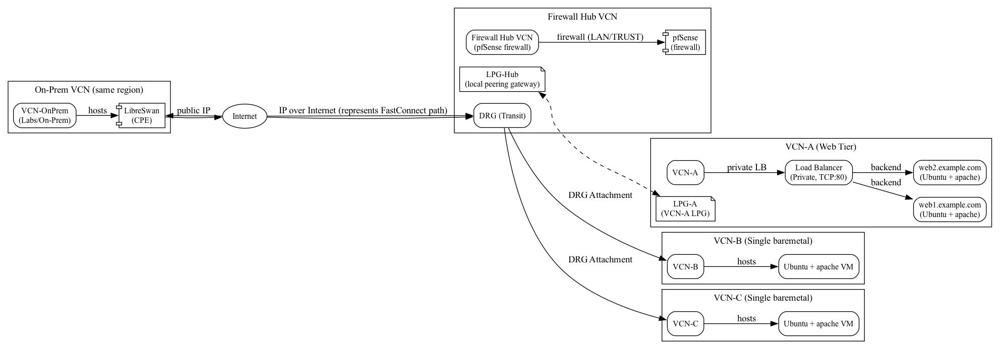
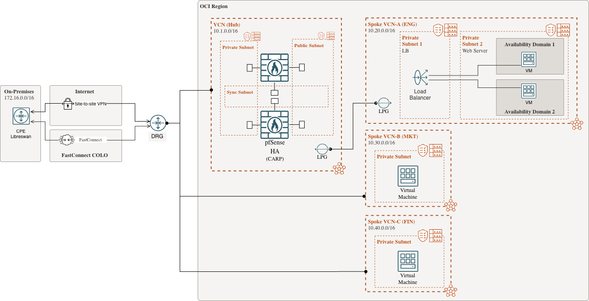

# OCI Lab to test Hybrid connectivity with DRG/LPG and centralized FW

## Summary
This lab evaluates the following:
- How to connect 3x different BU's using a zero trust approach leveraging OCI DRG route tables as network domains as well as centralized DPI and further ACL control via centralized firewall using pfSense firewalls in HA-mode (CARP).
- Simulate onprem access via another VCN connecting to OCI via DRG in the Transit VCN using IPsec VPN over Internet.
- Compare latency benchmarks results between DRG attachment to LPG peerings.
- Perform failover to test resiliency of some points of failure:
    * Stop one pfSense firewall to evaluate CARP failover setup.
    * Stop one webserver to evaluate LB backend failover.


> [!IMPORTANT]  
> Crucial information for the savvy network engineer reading while looking for guidance:
> 1. This is not a best practices design guide. Its sole purpose is to evaluate an OCI design to enforce centralized firewall inspection as needed.
> 2. There are two other obvious design options for the same goal: using an LB sandwich or the newer OCI Network Firewall as service. The latter introduces unnecessary overhead to this lab, with the advantage of adding A/A to the equation. The latter does not offer vendor flexibility yet, with the advantage of eliminating the maintenance lifecycle overhead of firewall instances, plus the addition of natively integrated security policy management.
> 3. Latest designs for workload protection tend to favor descentralized approaches with dynamic policy enforcement (think K8s environment with ever changing IP addresses within the same address space, but also possibly across different name spaces within K8s iself). This is NOT in the scope of this lab.
> 4. OCI would allow this design to scale to up to ~300 spoke VPCs, but that could easily create a bottle-neck depending on the scale of the E-W traffic.
> 5. The pfSense firewalls are not fully supported in OCI in their commercial version yet (like AWS and Azure), so enterprise support to achieve best networking benchmarks could be a problem.
> 6. It is NOT in the scope of this lab to tweak any of the NVA's for performance: SR-IOV, DPDK, other drivers settings, kernel segmentation offloads and packet steering, MTU, etc.


## LAB Topology
This is the original version generated by AI and rendered by **Graphviz DOT**. It is kept here for comparison purposes :)



A slightly improved version (made by humans with draw.io):


## LAB Design Scope

This repository contains Terraform code to build a small hub-and-spoke OCI lab with a firewall hub (pfSense HA) and an on-prem environment represented by a Libreswan instance connecting to DRG via IPsec over Internet.

- **Top-level folders**:
    - `hub_spoke_lab/` — main lab Terraform configuration and templates (primary working folder).
    - `topology/` — Graphviz DOT files and rendered diagrams.

- **Key files in `hub_spoke_lab/`**:
    - `providers.tf` — centralized Terraform provider and required_providers block.
    - `variables.tf` — variable declarations (images, SSH key, KMS key, BGP/PSK defaults).
    - `outputs.tf` — exported values such as pfSense and LibreSwan public IPs.
    - `firewall_hub.tf` — Firewall Hub VCN, subnets (WAN/Trust), DRG, pfSense HA instances and vNIC attachments.
    - `spokes_lpg_attach.tf` — Spoke VCN (VCN‑A) with LPG peering to the firewall hub, web instances and a private Load Balancer.
    - `spokes_drg_attach.tf` — Additional spoke VCNs (VCN‑B/VCN‑C) attached to the hub via DRG.
    - `onprem.tf` — On‑prem VCN, reserved public IP, Libreswan instance and OCI IPsec resources (CPE / IPsec connection / tunnel management).
    - `scripts/` — cloud-init / user-data templates used by instances (pfSense, web servers, Libreswan reconciliation script).

- **Networking summary**:
    - Hub VCN acts as a Firewall Hub with a DRG for transit to spoke DRG attachments and LPG for local peer to VCN‑A.
    - pfSense is deployed in HA with WAN and trust interfaces; trust networks connect to spokes.
    - VCN‑A uses an internal/private Load Balancer for web backends.
    - Libreswan instance simulates on‑prem: it uses a reserved public IP and is configured (via `user_data`) to establish an IKEv2/IPsec tunnel to the hub's DRG and run BGP (FRR) to exchange routes.

- **Operational notes**:
    - The code templates the Libreswan and pfSense bootstraps and writes a reconciliation systemd timer to persist BGP‑learned routes.
    - Sensitive values (PSKs, pfSense passwords) are handled as Terraform sensitive variables or generated resources (e.g., `random_password`).
    - The configuration targets OCI Provider v7.29.0 resource shapes (IPsec tunnel management, LB/Backend resources, etc.).

Use `hub_spoke_lab/` as your working directory; populate a `terraform.tfvars` with image OCIDs, `compartment_id`, `ad`, and secrets, then run `terraform init`, `terraform plan`, and `terraform apply`.


## HOW-TO run it
- Provide values for the following variables before `terraform apply`: `compartment_id`, `ad`, and `ssh_public_key`.
- Example `terraform.tfvars` (DO NOT check secrets into VCS):

```bash
# Example terraform.tfvars for hub_spoke_lab — replace placeholders with real values
region = "us-ashburn-1"
compartment_id = "ocid1.compartment.oc1..example"
ad = "Uocm:PHX-AD-1"
shape = "VM.Standard.E3.Flex"
ssh_public_key = "ssh-rsa AAAA... user@example"
web_domains = ["app1.example.com", "app2.example.com"]
lb_shape = "100Mbps"

# KMS key to encrypt instance source details (leave empty to skip)
kms_key_ocid = ""

```

Afterwards to run Terraform:
```bash
terraform init
terraform plan
terraform apply
```


## References:
1. https://docs.oracle.com/en-us/iaas/Content/Network/Concepts/fastconnectresiliency.htm
2. https://docs.oracle.com/en-us/iaas/Content/Network/Reference/libreswanCPE.htm
3. https://docs.oracle.com/en-us/iaas/Content/Network/Tasks/scenario_g.htm
4. https://docs.oracle.com/en-us/iaas/Content/Network/Tasks/scenario_d.htm#scenariod 
5. https://www.ateam-oracle.com/drgv2-hub-and-spoke-hub-nva-inspecting-the-traffic
6. https://medium.com/oracledevs/pfsense-plus-ha-on-oci-fdcb1013f381
7. https://docs.netgate.com/pfsense/en/latest/highavailability/test.html
8. https://docs.oracle.com/en-us/iaas/images/ubuntu-2204/canonical-ubuntu-22-04-2025-10-31-0.htm
9. https://atxfiles.netgate.com/mirror/downloads/
